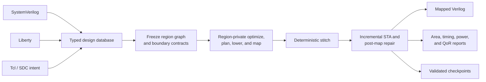

<!-- SPDX-FileCopyrightText: 2026 Zhengyi Zhang -->
<!-- SPDX-License-Identifier: GPL-3.0-only -->

<div align="center">

# Opto

### Deterministic, region-parallel logic synthesis for modern ASIC workflows

**SystemVerilog in. Liberty-mapped Verilog out. One executable, one Tcl flow.**

[](https://github.com/0xtaruhi/opto/actions/workflows/ci.yml)
[](https://github.com/0xtaruhi/opto/actions/workflows/nightly.yml)
[](https://github.com/0xtaruhi/opto/actions/workflows/docs.yml)
[](rust-toolchain.toml)
[](LICENSE)

[Quick start](#quick-start) ·
[Highlights](#highlights) ·
[Architecture](#architecture) ·
[Project status](#project-status) ·
[Documentation](#documentation) ·
[Contributing](#contributing)

</div>

Opto is an open-source synthesis shell written primarily in Rust. It presents
a familiar, DC-shaped Tcl command surface while using a typed database,
region-parallel optimization, deterministic assembly, Liberty technology
mapping, incremental timing analysis, and transactional post-map repair under
the hood.

> [!WARNING]
> Opto is under active development. It is not a signoff tool and does not yet
> cover a complete production ASIC flow. Unsupported behavior is rejected
> explicitly instead of being silently ignored.

## Highlights

| | |
|---|---|
| **One product entry point** | A single `opto` executable runs scripts, evaluates commands, or opens the interactive shell. There is no project-manager or manifest layer. |
| **Familiar Tcl surface** | Commands, arguments, collections, and reports draw from established ASIC synthesis workflows without claiming strict DC or Genus compatibility. |
| **One reproducible flow** | Every design follows the same production pipeline. Effort settings bound search policy; they do not select a hidden alternate architecture. |
| **Built for parallel scale** | Compact typed IDs, contiguous arenas, string interning, region-private work, and deterministic publication are first-class design constraints. |
| **Integrated analysis** | Typed timing constraints, setup/hold analysis, latch transparency, sparse scenarios, parasitics, power estimation, and incremental updates feed synthesis decisions. |
| **Evidence over claims** | Public qualification uses pinned language suites, real design hierarchies, equivalence checks, deterministic fingerprints, and reproducible QoR gates. |

## Quick start

### Prerequisites

- The latest stable Rust toolchain; Opto does not define a fixed MSRV.
- CMake 3.20 or newer, a C++20 compiler, and Git.
- `make` on Unix, or MSVC with `nmake` on Windows.
- Linux x86-64 builds use `clang` and the `mold` linker.

Clone the repository together with its pinned frontend dependencies:

```sh
git clone --recurse-submodules https://github.com/0xtaruhi/opto.git
cd opto
cargo build --release --locked
./target/release/opto -version
```

On Windows, run `target\release\opto.exe`. If the repository was cloned
without submodules, initialize them before building:

```sh
git submodule update --init --recursive
```

### Run a synthesis flow

Create a Tcl script such as `flow.tcl`:

```tcl
read_libs cells.lib
read_hdl top.sv
elaborate top
check_design
synth
report_area
report_timing
write_hdl mapped.v
```

Then run it:

```sh
./target/release/opto -f flow.tcl
```

For a quick non-interactive command:

```sh
./target/release/opto -no_init -x \
  "read_libs cells.lib; read_hdl top.sv; elaborate top; synth; report_area"
```

Run `./target/release/opto` without a script to enter the interactive Tcl
shell. Tcl 8.6 and its standard library are statically embedded, so no system
Tcl installation is required. SystemVerilog is parsed and elaborated through
the pinned [`slang`](third_party/slang) frontend.

## Architecture

Opto deliberately exposes a compact product surface while keeping parsing,
design storage, optimization, mapping, timing, and session orchestration in
separate typed domains.



The production pipeline performs region-parallel technology-independent
optimization and Liberty mapping, deterministic stitch, sparse logical MMMC
contract epochs, and transactional post-map repair. Read the normative
[architecture](docs/architecture.md), the implemented regional contract in
[RFC 0006](docs/rfcs/0006-region-parallel-synthesis.md), and the detailed
[cutover record](docs/refactoring.md) before making architecture claims.

The proposed replacement of the global front half with timing-driven
partitioning and region-private optimization remains documented separately in
[RFC 0007](docs/rfcs/0007-timing-driven-partitioning.md). An accepted RFC is
not presented as implemented behavior until the architecture conformance
matrix says so.

## What Opto is—and is not

| Opto is | Opto is not |
|---|---|
| A synthesis shell and implementation platform | A project manager or manifest-based build system |
| A coherent Tcl workflow influenced by DC and Genus | A strict compatibility clone of either tool |
| A deterministic regional synthesis architecture | A collection of user-selectable synthesis pipelines |
| A platform for reproducible public qualification | A source of unqualified commercial-tool parity claims |
| An actively developed pre-1.0 project | A signoff replacement for a production ASIC flow |

## Project status

Opto already implements a substantial synthesis and analysis path, but its
scope is intentionally stated conservatively. The shell reports unsupported
commands and modes as errors rather than accepting inert compatibility flags.

<details>
<summary><strong>Current capabilities and known limitations</strong></summary>

### Timing constraints

Typed support covers normal and generated clocks, clock
latency/transition/uncertainty/groups, propagated clocks, IO
delay/transition/load/drive/resistance, case analysis, disabled arcs, global
early/late derating, maximum design rules, and false/multicycle/max/min path
exceptions.

Remaining SDC gaps include driving-cell models, minimum capacitance, data and
clock-gating checks, minimum pulse width, ideal networks, path groups,
hierarchical instances, PVT/operating-condition selection, and public
multi-scenario configuration.

### Timing analysis

Setup and hold propagation, latch transparency, and incremental updates exist,
including generated clocks, global OCV derates, and same-clock CRPR. Recovery,
removal, and Liberty minimum-pulse-width checks are first-class endpoints.
Synthesis internally consumes an explicit sparse scenario set with correlated
early/min and late/max views; the Tcl shell currently constructs one active
scenario.

Gated-clock analysis, path groups, AOCV/POCV derating, useful skew, and hold
repair are not implemented.

### Attributes and ECO

Source attributes are preserved exactly. `blackbox`, `dont_touch`,
`keep_hierarchy`, `keep`, and `async_reg` have typed synthesis semantics, with
typed pre-synthesis `.dont_touch` and `.ungroup` properties.

Mapped-object directives, `set_size_only`, link models, ILM/ETM models, and
controlled ECO transforms are not implemented.

### Power and DFT

Activity-based power analysis and reporting exist. UPF, automatic clock-gating
insertion, multi-Vt leakage recovery, SAIF/VCD import, and glitch power do not.
Scan insertion, test protocol modeling, and test-ready synthesis are not
implemented.

### Libraries and interconnect

NLDM and scalar-anchored CCS/ECSM import with SPEF-backed Elmore networks exist.
CCS/ECSM waveform propagation over RC, SI/crosstalk, LVF, and advanced noise
models do not, so no signoff correlation is claimed.

### Physical awareness

There is no placement, congestion, or extracted interconnect model.
Comparisons against placement-aware flows such as DC Topographical, Fusion
Compiler, or Genus iSpatial are not meaningful yet.

### Memories

Complete inferred memory contracts remain first-class through regional
selection. The mapper chooses either a typed register bank or an exactly
compatible characterized RAM/ROM macro and materializes the selected
implementation atomically. Macro coverage is limited by the Liberty memory and
bus semantics currently imported.

### Scale and regional execution

Mapping uses stable connectivity-derived regions as the outer parallel unit,
bounded local candidates, compact portable plans, deterministic local-ID
stitch, dirty-region epochs, and reachable regional checkpoint records. Public
regressions cover pinned Ibex and CVA6 configurations.

Hundred-thousand-, million-, and ten-million-gate qualification and the stated
10× Genus target have not yet been demonstrated.

### Frontend

SystemVerilog coverage is measured against the pinned `sv-tests` and Yosys
corpora rather than claimed complete. VHDL and mixed-language designs are not
supported.

</details>

## Reproducibility

Synthesis has no transform, architecture, or search-budget switch. A result is
reproducible from its RTL, Tcl, SDC, and Liberty inputs. The `synth_effort`
setting changes bounded search and convergence policy only; it does not select
a different representation or production path.

`OPTO_DEBUG_TIMING`, `OPTO_DEBUG_JOINTS`, `OPTO_DEBUG_MFS`, and
`OPTO_CHECK_INCREMENTAL` add developer diagnostics without changing the
intended result. Qualification and benchmark harnesses remove inherited
`OPTO_*` variables before launching `opto`, so measurements never inherit a
developer shell setting.

## Documentation

| Resource | Purpose |
|---|---|
| [Architecture](docs/architecture.md) | Normative boundaries, production workflow, conformance matrix, and qualification contract |
| [Command-surface RFC](docs/rfcs/0010-command-surface.md) | Tcl lifecycle, command naming, collections, properties, and reports |
| [Qualification guide](qualification/README.md) | Verification tiers, equivalence suites, coverage, and reproduction commands |
| [QoR methodology](benchmarks/qor/README.md) | Public benchmark policy, baselines, metrics, and dashboard generation |
| [Versioning](docs/versioning.md) | Release channels and compatibility policy |
| [Changelog](CHANGELOG.md) | User-visible release history |
| [Security policy](SECURITY.md) | Supported versions and private vulnerability reporting |

The documentation workflow publishes the mdBook architecture guide and Rust
API documentation through GitHub Pages.

## Development

For a faster optimized edit-build-run loop, use the development release
profile. Published runtime and QoR numbers must use `--release`; CI trend
measurements may use `fast-release` when the profile is recorded explicitly.

```sh
cargo build --profile fast-release --locked
./target/fast-release/opto -version
```

When using multiple Git worktrees, point `CARGO_TARGET_DIR` at one shared local
directory to avoid rebuilding the pinned C++ frontend for every worktree:

```sh
export CARGO_TARGET_DIR=/tmp/opto-target
```

Core local quality gates are:

```sh
python3 tools/check_architecture.py
python3 tools/check_license_headers.py
python3 tools/check_public_repository.py
cargo fmt --all -- --check
cargo check --workspace --all-targets --all-features --locked
cargo clippy --workspace --all-targets --all-features --locked -- -D warnings
cargo test --workspace --all-targets --all-features --locked
```

See [CONTRIBUTING.md](CONTRIBUTING.md) for setup, testing, architecture, and
public-data requirements. Coding agents and automated contributors should also
follow [AGENTS.md](AGENTS.md).

## Public data policy

Proprietary PDK files, synthesized libraries, commercial-tool scripts and logs,
license configuration, private QoR baselines, and internal regression assets
are intentionally excluded. Keep those inputs outside this checkout. Public
benchmarks must use redistributable inputs or pinned sources verified by
checksum.

Pinned third-party source and license locations are documented in
[third_party/README.md](third_party/README.md).

## Contributing

Contributions are welcome. Small bug fixes may go directly to a pull request;
please discuss substantial architecture, command compatibility, persistence,
or synthesis-policy changes in an issue first.

- Read the [contributing guide](CONTRIBUTING.md).
- Follow the [code of conduct](CODE_OF_CONDUCT.md).
- Report vulnerabilities through the [security policy](SECURITY.md), not a
  public issue.
- Review the [RFC process](docs/rfcs/README.md) for architectural proposals.

## License

Unless otherwise noted, Opto-authored code is licensed under the
[GNU General Public License, version 3 only](LICENSE). The GPL permits
commercial use when its terms are followed; no separate agreement is required
for GPL-compliant use.

Organizations that need proprietary redistribution, closed-source or OEM
embedding, or negotiated support, warranty, indemnity, or service commitments
can request a separate commercial license. See
[Commercial Licensing](COMMERCIAL-LICENSING.md) for scope and contact details.
Third-party components and data remain under the licenses included with those
materials.

If Opto contributes to your research, please use the metadata in
[CITATION.cff](CITATION.cff). Release history is recorded in
[CHANGELOG.md](CHANGELOG.md).
